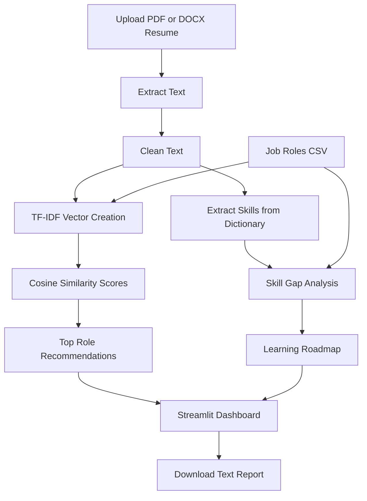

# Architecture Diagram

```mermaid
flowchart TD
    A[Upload PDF or DOCX Resume] --> B[Extract Text]
    B --> C[Clean Text]
    C --> D[Extract Skills from Dictionary]
    C --> E[TF-IDF Vector Creation]
    F[Job Roles CSV] --> E
    E --> G[Cosine Similarity Scores]
    D --> H[Skill Gap Analysis]
    F --> H
    G --> I[Top Role Recommendations]
    H --> J[Learning Roadmap]
    I --> K[Streamlit Dashboard]
    J --> K
    K --> L[Download Text Report]
```
